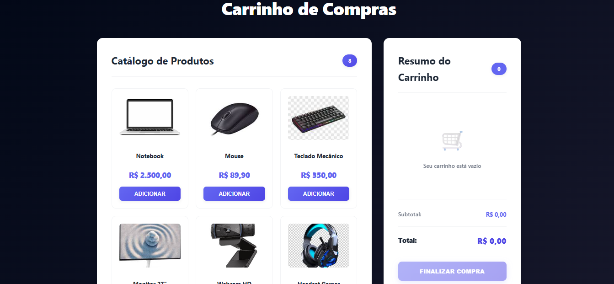
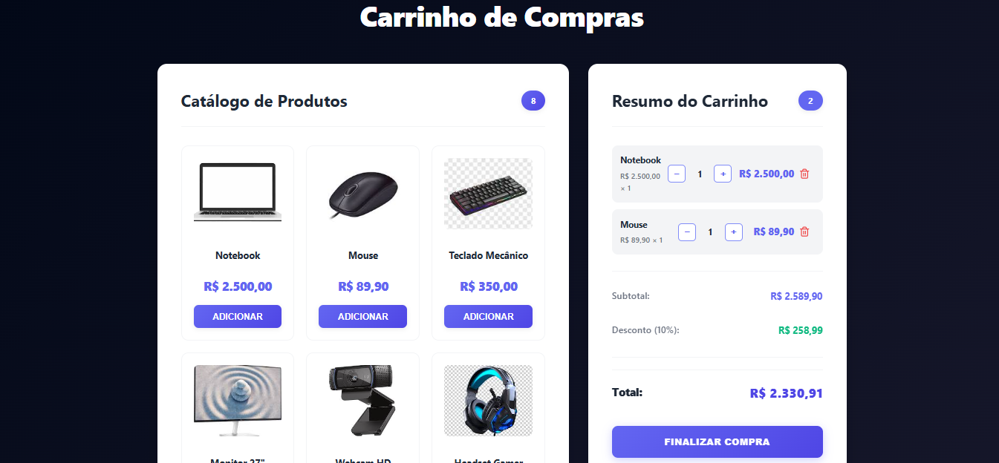

# 🛒 Carrinho de Compras com Array.reduce()

> Um projeto web completo de carrinho de compras desenvolvido como desafio GoDevs 2026, demonstrando o poder do método `Array.reduce()` em cálculos e manipulação de dados.

## 📋 Sumário

- [Visão Geral](#-visão-geral)
- [Funcionalidades](#-funcionalidades)
- [Tecnologias](#-tecnologias)
- [Requisitos](#-requisitos)
- [Como Usar](#-como-usar)
- [Estrutura do Projeto](#-estrutura-do-projeto)
- [Array.reduce() no Projeto](#-arrayreduce-no-projeto)
- [Capturas de Tela](#-capturas-de-tela)
- [Desenvolvedor](#-desenvolvedor)
- [Agradecimentos](#-agradecimentos-e-referências)

<h2 id="-visão-geral">👁️ Visão Geral</h2>

Este projeto é um carrinho de compras totalmente funcional desenvolvido em **HTML5, CSS3 e JavaScript vanilla**. O destaque principal é o uso extensivo do método `Array.reduce()` para todos os cálculos de subtotal, desconto e contagem de itens, demonstrando como programação funcional pode simplificar operações complexas.

### Características Principais

✨ **Interface moderna e responsiva** com design profissional  
🔢 **Cálculos com Array.reduce()** para operações financeiras  
💱 **Formatação de moeda em tempo real** usando Intl API (pt-BR)  
📱 **Fully responsive** - funciona perfeitamente em todos os dispositivos  
⚡ **Performance otimizada** com código limpo e sem comentários desnecessários  
🎨 **Design escuro moderno** com tema gradiente elegante  

<h2 id="-funcionalidades">⚙️ Funcionalidades</h2>

- ✅ Exibição de catálogo de 8 produtos com imagens
- ✅ Adicionar produtos ao carrinho
- ✅ Remover itens do carrinho
- ✅ Aumentar/diminuir quantidade de itens
- ✅ Cálculo automático de subtotal com Array.reduce()
- ✅ Aplicação de desconto de 10% com Array.reduce()
- ✅ Contagem total de itens com Array.reduce()
- ✅ Desconto visível apenas quando há itens no carrinho
- ✅ Formatação de moeda em Real (R$)
- ✅ Mensagem de confirmação personalizada ao finalizar compra
- ✅ Carrinho vazio e validações

<h2 id="-tecnologias">🛠️ Tecnologias</h2>


### Apis Utilizadas

- **Intl.NumberFormat** - Formatação de moeda com localização
- **Array.reduce()** - Cálculos funcionais de dados
- **DOM API** - Manipulação e renderização do HTML

<h2 id="-requisitos">📋 Requisitos</h2>

- Navegador moderno (Chrome, Firefox, Safari, Edge)
- Nenhuma dependência externa necessária
- Sem necessidade de servidor backend

### Browser Support

| Chrome | Firefox | Safari | Edge |
|--------|---------|--------|------|
| ✅ Suportado | ✅ Suportado | ✅ Suportado | ✅ Suportado |

<h2 id="-como-usar">🚀 Como Usar</h2>

### 1. Clone o repositório

```bash
git clone https://github.com/Guielihan/carrinho-de-compras-com-array.reduce.git
cd carrinho-de-compras-com-array.reduce
```

### 2. Abra o projeto

Simplesmente abra o arquivo `index.html` no seu navegador:

```bash
# Windows
start index.html

# macOS
open index.html

# Linux
xdg-open index.html
```

Ou use um servidor local:

```bash
# Com Python 3
python -m http.server 8000

# Com Node.js (http-server)
npx http-server
```

Acesse `http://localhost:8000` no seu navegador.

### 3. Use o carrinho

1. Selecione produtos clicando em "Adicionar"
2. Ajuste as quantidades com os botões + e -
3. Veja o desconto aparecer automaticamente
4. Clique em "Finalizar Compra" para confirmar
5. Seu carrinho será resetado após a confirmação

<h2 id="-estrutura-do-projeto">📁 Estrutura do Projeto</h2>

```
carrinho-de-compras-com-array.reduce/
│
├── index.html              # Estrutura HTML semântica
├── css/
│   └── style.css          # Estilos e responsividade (661 linhas)
├── js/
│   └── script.js          # Lógica com Array.reduce() (192 linhas otimizado)
├── assets/
│   ├── notebook.png
│   ├── mouse.png
│   ├── teclado-mecanico.png
│   ├── monitor-27.png
│   ├── webcam-hd.png
│   ├── headset-gamer.png
│   ├── ssd-1tb.png
│   └── memoria-ram-16gb.png
├── README.md               # Este arquivo
└── .gitignore            # Git ignore rules
```

<h2 id="-arrayreduce-no-projeto">🔍 Array.reduce() no Projeto</h2>

### 1. Cálculo de Subtotal

```javascript
function calculateSubtotal() {
    return cart.reduce((total, item) => 
        total + (item.price * item.quantity), 0
    );
}
```
Multiplica preço × quantidade e soma todos os itens.

### 2. Contagem de Itens

```javascript
function getTotalItemCount() {
    return cart.reduce((count, item) => 
        count + item.quantity, 0
    );
}
```
Soma as quantidades de todos os itens.

### 3. Cálculo de Desconto

```javascript
function calculateDiscount(subtotal) {
    return subtotal * (DISCOUNT_PERCENTAGE / 100);
}
```
Aplica 10% de desconto sobre o subtotal.

<h2 id="-capturas-de-tela">📸 Capturas de Tela</h2>

### Preview do Projeto


*Carrinho inicial vazio com resumo limpo*


*Carrinho com produtos adicionados e desconto visível*


*Layout responsivo em dispositivos móveis*

<h2 id="-desenvolvedor">👨‍💻 Desenvolvedor</h2>

**Guilherme Queiroz (Guielihan)**

<div style="display: flex; gap: 10px; flex-wrap: wrap;">
  <a href="https://discord.com/users/1297971679737413632">
    
  </a>
  <a href="https://www.instagram.com/devguielihan/">
    
  </a>
  <a href="mailto:devguielihan@gmail.com">
    
  </a>
</div>

<h2 id="-agradecimentos-e-referências">🎓 Agradecimentos e Referências</h2>

<div style="display: flex; gap: 10px; flex-wrap: wrap;">
  <a href="https://github.com/in100tiva">
    
  </a>
  <a href="https://godevs.in100tiva.com/">
    
  </a>
</div>

---

<p align="center">
  Feito com 💙 por Guielihan
  <br>
  © GoDevs 2026
</p>
